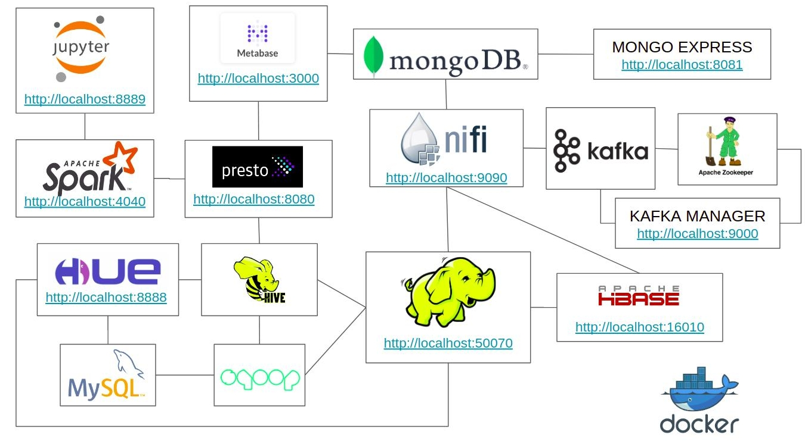

<p align="center">
  <a href="" rel="noopener">
 </a>
</p>

<h3 align="center">Bootcamp ****** - IGTI - Módulo ******</h3>

<div align="center">

[]()
[](/LICENSE)

</div>

---
# 📝 Arquitetura de Big Data no Docker <a name = "about"></a>

### Ambiente desenvolvido para realização do estudo prático do bootcamp x no módulo y, utilizando as principais tecnologias de big data em um ambiente dockernizado, esse setup utilizando o docker-compose.yml irá criar containers com as tecnologias abaixo:

- HDFS
- HBASE
- HIVE
- PRESTO
- SPARK
- JUPYTER
- HUE
- MONGODB
- METABSE
- NIFI
- KAFKA
- MYSQL
- ZOOKEEPER



# Requisítos obrigatórios para criação do ambiente.

- DOCKER

- GIT

### No seu terminal, realize o clone do projeto no github

```bash
git clone git@github.com:carlosbpy/igti-hadoop-exercise.git
```

### No seu terminal, no diretorio igti-hadoop-exercise, execute o seguinte comando:
```bash
docker-compose up -d
```        


## Acesso a Interface Web das Ferramentas
 
* HDFS *http://localhost:50070*
* Presto *http://localhost:8080*
* Hbase *http://localhost:16010/master-status*
* Mongo Express *http://localhost:8081*
* Kafka Manager *http://localhost:9000*
* Metabase *http://localhost:3000*
* Nifi *http://localhost:9090*
* Jupyter Spark *http://localhost:8889*
* Hue *http://localhost:8888*
* Spark *http://localhost:4040*

## Usuários e senhas

   ### Hue
    Usuário: admin
    Senha: admin

   ### Metabase
    Usuário: bigdata@class.com
    Senha: bigdata123 

   ### MySQL
    Usuário: root
    Senha: secret
   
   ### MongoDB
    Usuário: root
    Senha: root
    Authentication Database: admin


### Documentação Oficial
* https://zookeeper.apache.org/
* https://kafka.apache.org/
* https://nifi.apache.org/
* https://prestodb.io/
* https://spark.apache.org/
* https://www.mongodb.com/
* https://www.metabase.com/
* https://jupyter.org/
* https://hbase.apache.org/
* https://sqoop.apache.org/
* https://hadoop.apache.org/
* https://hive.apache.org/
* https://gethue.com/
* https://github.com/yahoo/CMAK
* https://www.docker.com/
